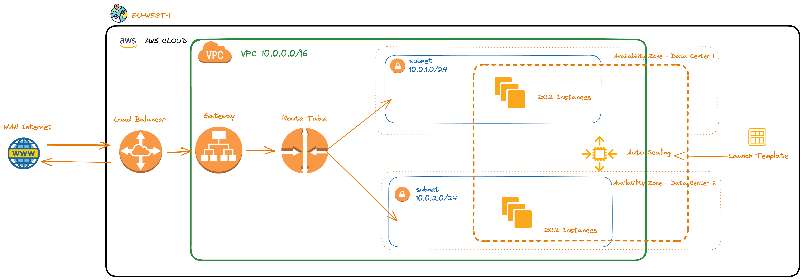

## Branch Information

This repository has several branches, each demonstrating a different setup configuration.

- [With Public and Private Subnets, Bastion Host and NAT Gateway](https://github.com/0xbochi/aws-ha-load-balancers-with-ec2/tree/with-public-subnets): This branch provides a setup where EC2 instances are deployed in private subnets. A bastion host is used for secure SSH access to these private instances, and a NAT gateway is configured for secure outbound internet access. All the incoming traffic is routed through an Application Load Balancer (ALB) residing in the public subnet.

Stay tuned as more branches with different setup configurations are added. For more information, refer to the specific README.md of each branch.

# Terraform AWS Project with Python Script

This project demonstrates how to automate the creation and configuration of AWS resources using Terraform and Python scripts. The aim is to setup a scalable and secure web service. The infrastructure includes an AWS VPC with subnets, security groups, an auto-scaling group with EC2 instances, and an application load balancer. 

## Project Components



1. **VPC and Networking**: A VPC is created along with an Internet Gateway. Two subnets are configured within different availability zones. A route table is defined to allow traffic from the subnets to the internet. This setup ensures high availability of the resources.

2. **Security Groups**: Two security groups are defined, one for the EC2 instances and the other for the load balancer. This is to secure the web service by allowing only the necessary traffic.

3. **EC2 Instances**: EC2 instances are created using a launch template. The instances are configured with a bootstrap script to install and start the Nginx web server, and display the hostname on the web page.

4. **Auto-Scaling Group**: The EC2 instances are managed by an auto-scaling group. It scales the number of instances based on CPU utilization.

5. **Load Balancer**: An application load balancer is setup to distribute incoming traffic across the EC2 instances.

6. **Key Pair**: An AWS key pair is created to allow SSH access to the EC2 instances.

7. **Python Script**: A Python script is provided to fetch the details of running EC2 instances.

## Prerequisites

- Terraform
- AWS account with the necessary permissions
- Python and boto3 library

## Usage

1. Clone the repository.
2. Navigate to the project directory.
3. Initialize the Terraform providers:
```
terraform init
```
4. Check the Terraform plan:
```
terraform plan
```
5. Apply the Terraform configuration:
```
terraform apply
```
6. After the infrastructure is created, you can run the Python script to get the details of the EC2 instances:
```
python main.py
```

The outputs will include the DNS name of the load balancer and the public DNS of the running EC2 instances.

## Note

Replace the value of `public_key` in `ec2.tf` file with the path to your public key if you are not using the default location.

## Contributing

Pull requests are welcome. For major changes, please open an issue first to discuss what you would like to change.

## License

[MIT](https://choosealicense.com/licenses/mit/)